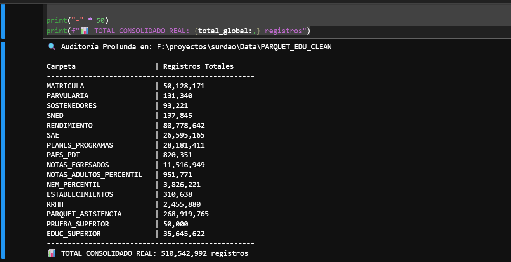
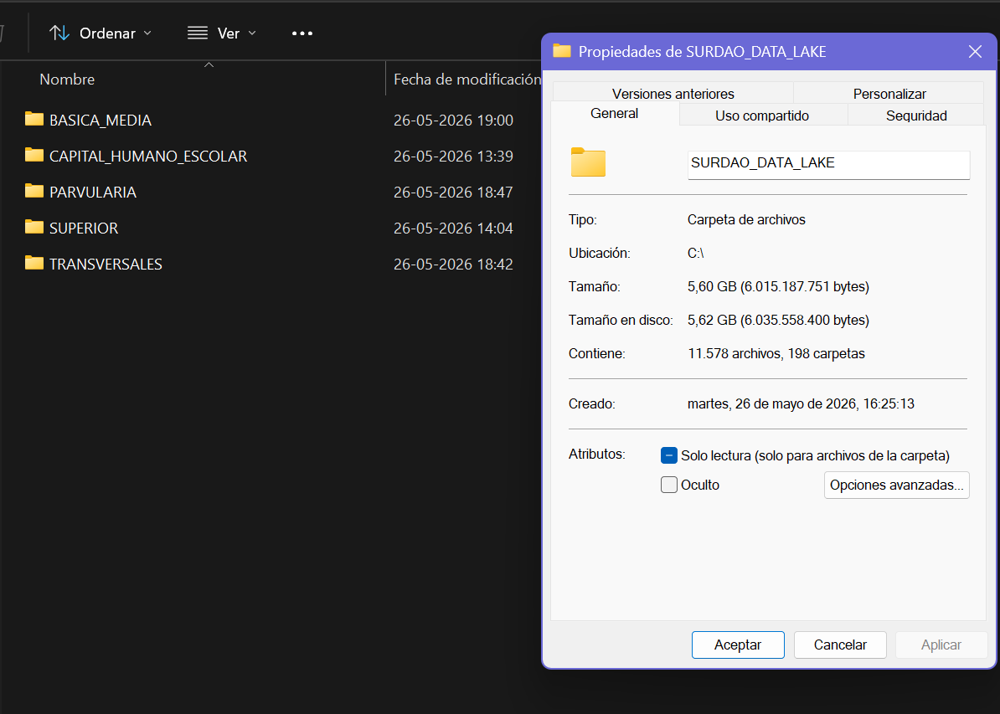
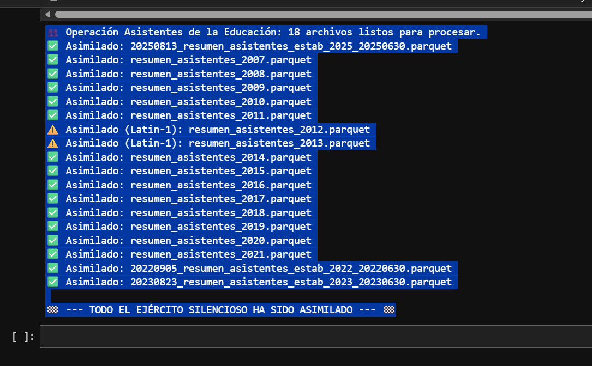
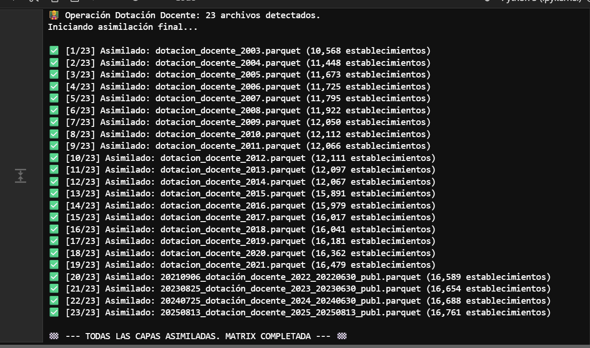
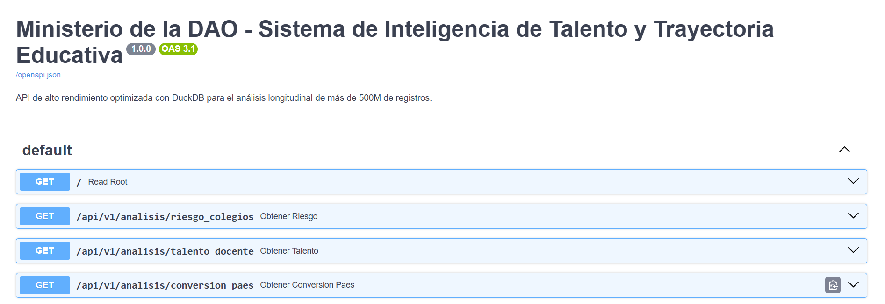

  
# 👨‍💻 TIANHH77

**Data Architect & Civic Tech Builder | Creador de infraestructura para datos públicos | Analista de autodidacta de sistemas**

---

<b>🇺🇸 English Version (Click to expand)</b>

 

I combine the systemic and critical vision of Occupational Therapy with massive data engineering to audit, unify, and make sense of information at scale.

### 🚀 What I'm currently working on
* ⚖️ **Transparency Systems (SUR DAO):** Developing a forensic audit protocol for academic trajectories. I process over 510 million state records (from Early Childhood to Higher Education) to democratize data governance.
* 🏗️ **Large-Scale Engineering:** Designing and maintaining a local Longitudinal Data Lake of over 5.6 GB. I optimize pipelines with columnar storage (Parquet) and in-memory processing (DuckDB) to execute statistical cross-references in milliseconds.
* 🤖 **AI Assistants:** Integrating Telegram bots powered by RAG (Retrieval-Augmented Generation) and Embeddings to query institutional regulations and complex databases using natural language.
* 🔌 **Backend & Integrations:** Building hybrid ecosystems that combine traditional relational databases with ultra-fast REST interfaces using FastAPI.
* 📷 **Digital Preservation (Interactive Atlas):** Developing an automated pipeline (Python + Vanilla JS) for the preservation, geolocation, and web rendering of a historical archive with over 1,500 visual records.

### 🛠️ Tech Stack
* **Data Engineering & Databases:** DuckDB, Parquet Ecosystem, Pandas, MySQL, SQL.
* **Architecture:** Domain-Driven Design (Medallion Architecture), Data Lakes, Data Governance.
* **Backend & APIs:** Python, FastAPI, Telegram Bot API.
* **Artificial Intelligence:** RAG, Embeddings, LLMs.
* **Tools:** Git, Git LFS.

### 📊 Production and Scale Evidence
*Nothing speaks louder than running code. Below are some screenshots of the in-memory processing engine and the Data Lake infrastructure assimilating historical state data:*

**1. Deep Audit: +510 Million Records**
Forensic scanning of educational domains using DuckDB. The engine unifies 12 different domains in record time. 
 

**2. Local Data Lake Infrastructure**
+11,500 fragmented files unified and transformed into a columnar ecosystem (Parquet) optimized for analytics. 
 

**3. Data Assimilation Pipelines (ETL)**
Conversion scripts processing the complete series of Teacher Evaluation (ECEP) and the Silent Army (Education Assistants). 
 

 

**4. REST API Deployment (FastAPI)**
Ultra-fast query interface documented with Swagger/OpenAPI. It exposes the Data Lake's analytical cross-references (institutional risk, teaching talent, and PAES conversion) ready for production consumption.
 

 

<b>🇧🇷 Versão em Português (Clique para expandir)</b>

 

Combino a visão sistêmica e crítica da Terapia Ocupacional com a engenharia de dados em larga escala para auditar, unificar e dar sentido à informação em grande escala.

### 🚀 O que estou fazendo atualmente
* ⚖️ **Sistemas de Transparência (SUR DAO):** Desenvolvendo um protocolo de auditoria forense para trajetórias acadêmicas. Processo mais de 510 milhões de registros estatais (da Educação Infantil ao Ensino Superior) para democratizar a governança de dados.
* 🏗️ **Engenharia em Larga Escala:** Projetando e mantendo um Data Lake Longitudinal local de mais de 5,6 GB. Otimizo pipelines com armazenamento colunar (Parquet) e processamento in-memory (DuckDB) para executar cruzamentos estatísticos em milissegundos.
* 🤖 **Assistentes com IA:** Integrando bots do Telegram potencializados com RAG (Retrieval-Augmented Generation) e Embeddings para consultar normas institucionais e bancos de dados complexos usando linguagem natural.
* 🔌 **Backend & Integrações:** Construindo ecossistemas híbridos que combinam bancos de dados relacionais tradicionais com interfaces REST ultrarrápidas usando FastAPI.
* 📷 **Preservação Digital (Atlas Interativo):** Desenvolvimento de um pipeline automatizado (Python + Vanilla JS) para a preservação, geolocalização e renderização web de um arquivo histórico de mais de 1.500 registros visuais.

### 🛠️ Stack Tecnológico
* **Engenharia de Dados e Bancos de Dados:** DuckDB, Ecossistema Parquet, Pandas, MySQL, SQL.
* **Arquitetura:** Design Orientado a Domínios (Medallion Architecture), Data Lakes, Governança de Dados.
* **Backend e APIs:** Python, FastAPI, Telegram Bot API.
* **Inteligência Artificial:** RAG, Embeddings, LLMs.
* **Ferramentas:** Git, Git LFS.

### 📊 Evidência de Produção e Escala
*Nada fala mais alto do que o código em execução. Abaixo, algumas capturas do motor de processamento in-memory e da infraestrutura do Data Lake assimilando os dados históricos do Estado:*

**1. Auditoria Profunda: +510 Milhões de Registros**
Escaneamento forense dos domínios educacionais usando DuckDB. O motor unifica 12 domínios diferentes em tempo recorde. 
 

**2. Infraestrutura do Data Lake Local**
+11.500 arquivos fragmentados unificados e transformados em um ecossistema colunar (Parquet) otimizado para análise. 
 

**3. Pipelines de Assimilação de Dados (ETL)**
Scripts de conversão processando a série completa de Avaliação Docente (ECEP) e o Exército Silencioso (Assistentes da Educação). 
 

 

**4. Implantação de API REST (FastAPI)**
Interface de consulta ultrarrápida documentada com Swagger/OpenAPI. Expõe os cruzamentos analíticos do Data Lake (risco institucional, talento docente e conversão PAES) prontos para consumo em produção.
 

 

<b>🇪🇸 Versión en Español</b>

 

Combino la visión sistémica y crítica de la Terapia Ocupacional con la ingeniería de datos masiva para auditar, unificar y dar sentido a la información a gran escala.

### 🚀 Qué estoy haciendo actualmente
* ⚖️ **Sistemas de Transparencia (SUR DAO):** Desarrollando un protocolo de auditoria forense para trayectorias académicas. Proceso más de 510 millones de registros estatales (desde Educación Parvularia hasta Superior) para democratizar la gobernanza de datos.
* 🏗️ **Ingeniería a Gran Escala:** Diseñando y manteniendo un Data Lake Longitudinal local de más de 5.6 GB. Optimizo pipelines con almacenamiento columnar (Parquet) y procesamiento in-memory (DuckDB) para ejecutar cruces estadísticos en milisegundos.
* 🤖 **Asistentes con IA:** Integrando bots de Telegram potenciados con RAG (Retrieval-Augmented Generation) y Embeddings para consultar normativas institucionales y bases de datos complejas mediante lenguaje natural.
* 🔌 **Backend & Integraciones:** Construyendo ecosistemas híbridos que combinan bases de datos relacionales tradicionales con interfaces REST ultrarrápidas mediante FastAPI.
* 📷 **Preservación Digital (Atlas Interactivo):** Desarrollo de un pipeline automatizado (Python + Vanilla JS) para la preservación, geolocalización y renderizado web de un archivo histórico de más de 1.500 registros visuales.

### 🛠️ Stack Tecnológico
* **Data Engineering & Bases de Datos:** DuckDB, Ecosistema Parquet, Pandas, MySQL, SQL.
* **Arquitectura:** Diseño por Dominios (Medallion Architecture), Data Lakes, Gobernanza de Datos.
* **Backend & APIs:** Python, FastAPI, Telegram Bot API.
* **Inteligencia Artificial:** RAG, Embeddings, LLMs.
* **Herramientas:** Git, Git LFS.

### 📊 Evidencia de Producción y Escala
*Nada habla más fuerte que el código en ejecución. A continuación, algunas capturas del motor de procesamiento in-memory y la infraestructura del Data Lake asimilando los datos históricos del Estado:*

  

**1. Auditoría Profunda: +510 Millones de Registros**
Escaneo forense de los dominios educativos utilizando DuckDB. El motor unifica 12 dominios distintos en tiempo récord. 
 

**2. Infraestructura del Data Lake Local**
+11.500 archivos fragmentados unificados y transformados a ecosistema columnar (Parquet) optimizado para analítica. 
 

**3. Pipelines de Asimilación de Datos (ETL)**
Scripts de conversión procesando la serie completa de Evaluación Docente (ECEP) y el Ejército Silencioso (Asistentes de la Educación). 
 

 

**4. Despliegue de API REST (FastAPI)**
Interfaz de consulta ultrarrápida documentada con Swagger/OpenAPI. Expone los cruces analíticos del Data Lake (riesgo institucional, talento docente y conversión PAES) listos para consumo en producción.
 

 

